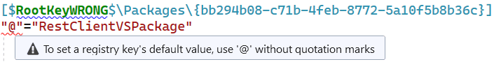
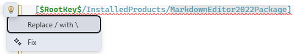
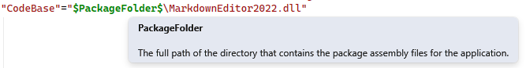
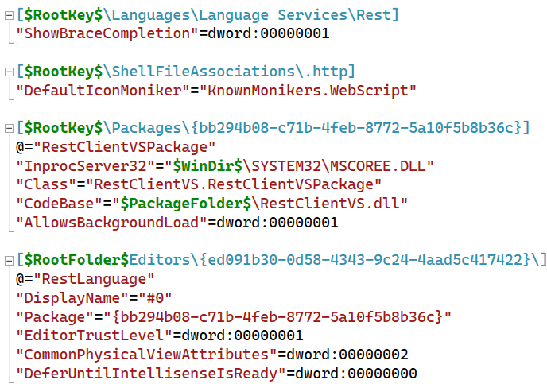

[marketplace]: https://marketplace.visualstudio.com/items?itemName=MadsKristensen.PkgdefLanguage
[vsixgallery]: http://vsixgallery.com/extension/06278dd5-5d9d-4f27-a3e8-cd619b101a50/
[repo]:https://github.com/madskristensen/PkgdefLanguage/

# Pkgdef Language for Visual Studio

Download this extension from the [Visual Studio Marketplace][marketplace]
or get the [CI build][vsixgallery].

--------------------------------------

This extension provides basic language support for .pkgdef and .pkgundef files in Visual Studio.

## Syntax highlighting
Syntax highlighting makes it easy to parse the document. Here's what it looks like:

## IntelliSense
Full completion is provided throughout your .pkgdef files to speed up development and reduce errors:

**Variables** - Type `$` to see all available predefined variables like `$RootKey$`, `$PackageFolder$`, `$RootFolder$`, etc.

**Registry Keys** - When typing registry paths within `[]` brackets, get suggestions for valid subkeys based on your current path in the registry hive.

**Property Names** - After defining a registry key, get completion for common property names.

**Property Values** - When assigning values, get suggestions for common registry value types like `dword:`, `qword:`, and `hex:`.

## Validation
The extension provides comprehensive validation to help you avoid mistakes in your .pkgdef files:

**Syntax Validation:**
- Unclosed registry key brackets
- Missing or incorrect quotation marks on property names
- Forward slashes in registry paths (should be backslashes)
- Unknown tokens and malformed syntax

**Variable Validation:**
- Unknown or undefined variables
- Invalid variable syntax (missing `$` delimiters)
- Typos in variable names

**Registry Value Type Validation:**
- **DWORD values** - Must be exactly 8 hexadecimal characters (e.g., `dword:0000007b`)
- **QWORD values** - Must be exactly 16 hexadecimal characters (e.g., `qword:00000000ffffffff`)
- **HEX arrays** - Must be comma-separated 2-digit hexadecimal bytes (e.g., `hex:01,02,03,04,ff`)

**Semantic Validation:**
- Duplicate registry key definitions
- Quoted `@` symbol (default value should be unquoted)

For detailed information about each validation error, including examples and fixes, see the [Error Reference](errors.md).

### Quick Fixes
The extension provides automatic code fixes for common errors. Simply press `Ctrl+.` on any error to see available fixes:

**Available Quick Fixes:**
- **Missing closing bracket** - Automatically adds the missing `]` to registry keys
- **Forward slashes in paths** - Converts `/` to `\` in registry paths
- **Quoted @ sign** - Removes quotes from default value property (`"@"` → `@`)
- **Unquoted property names** - Surrounds property names with required quotation marks

## Quick Info
Hover over elements to get helpful information:

**Variable Information:**
- Hover over any variable (e.g., `$RootKey$`) to see its description and what it resolves to

**Error Details:**
- Hover over validation errors to see the error message and clickable error code
- Click the error code to open detailed documentation with examples and fixes

## Outlining
Collapse sections for better overview of the document.

Notice how only comments starting with a semicolon is correctly identified as a comment.

## Formatting
You can format the whole document `Ctrl+K,Ctrl+D` or the current selection `Ctrl+K,Ctrl+F`. It will add a line break between registry key entries, trim whitespace, and other clean-up formatting.

---

### How can I help?
If you enjoy using the extension, please give it a ★★★★★ rating on the [Visual Studio Marketplace][marketplace].

Should you encounter bugs or if you have feature requests, head on over to the [GitHub repo][repo] to open an issue if one doesn't already exist.

Pull requests are also very welcome, since I can't always get around to fixing all bugs myself. This is a personal passion project, so my time is limited.

Another way to help out is to [sponsor me on GitHub](https://github.com/sponsors/madskristensen).