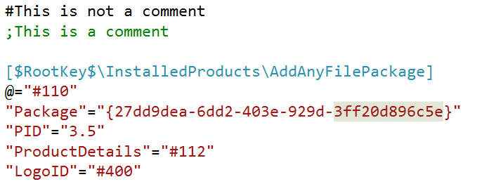
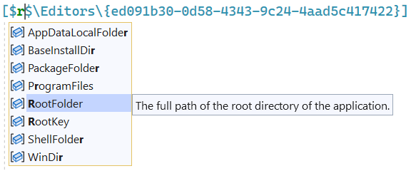
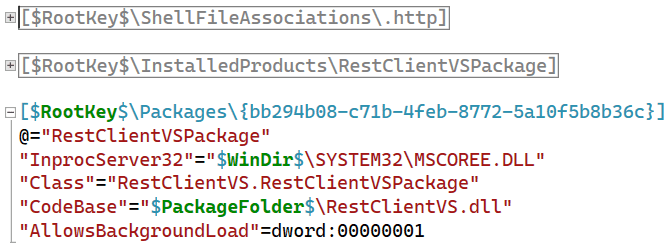

# Pkgdef Language for Visual Studio

Download this extension from the [Visual Studio Marketplace](https://marketplace.visualstudio.com/items?itemName=MadsKristensen.PkgdefLanguage)
or get the [CI build](http://vsixgallery.com/extension/06278dd5-5d9d-4f27-a3e8-cd619b101a50/).

--------------------------------------

This extension provides basic language support for .pkgdef and .pkgundef files in Visual Studio.

## Syntax highlighting
Syntax highligting makes it easy to parse the document. Here's what it looks like:

## IntelliSense
Full completion provided for variables.

## Outlining
Collapse sections for better overview of the document.

Notice how only comments starting with a semicolon is correctly identified as a comment. 

## License
[Apache 2.0](LICENSE)